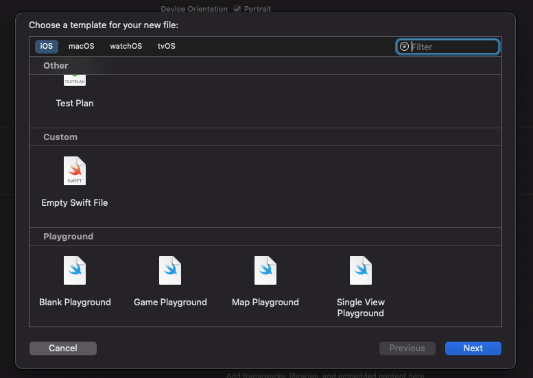

# xcode-custom-template-starter

Template for `Xcode File Template`

## Bootstrap

```bash
make link
```

Create Symbolic Link to selected Xcode directory (used this output: `xcode-selet -p`)

## Templates

```
├── Templates
│   └── Custom    # Display to Section Name in Xcode
│       └── Empty\ Swift\ File.xctemplate    # Sample
```

in Xcode


